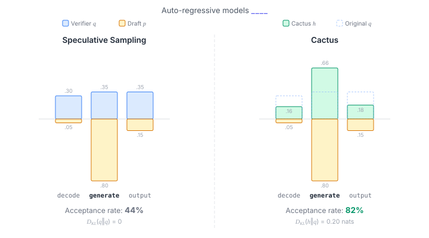

# Cactus: **C**onstrained **Ac**cep**t**ance Spec**u**lative **S**ampling

**Paper:** [Cactus: Constrained Acceptance Speculative Sampling](https://openreview.net/forum?id=lpUIkCAy9p) (ICLR 2026)


Cactus is a speculative decoding method that provably increases token acceptance rates while bounding the divergence from the target distribution. It works as a drop-in replacement for the rejection sampler in [vLLM](https://github.com/vllm-project/vllm).

Cactus increases the verifier's acceptance threshold for the drafted token while proportionally downweighting the rest, subject to a KL-divergence budget controlled by `delta`.

<p align="center">
  
</p>

In the example above, the draft commits to "generate" but the verifier spreads probability evenly. SpS accepts at only 44%. Cactus boosts "generate" from .35 to .66, raising acceptance to 82% at a cost of just 0.20 nats of KL divergence.


## Quick Start

Cactus integrates with vLLM via monkey-patching and uses [lm-eval](https://github.com/EleutherAI/lm-evaluation-harness) for benchmarking. The main entry point is `spec.py`:

```bash
uv run python spec.py \
    -m Qwen/Qwen3-14B \
    -s Qwen/Qwen3-0.6B \
    -n 10 \
    -c cactus \
    --delta 1.0 \
    -t gsm8k
```

To run without speculative decoding (baseline):

```bash
uv run python spec.py \
    -m Qwen/Qwen3-14B \
    -c naive \
    -t gsm8k
```

## Key Parameters

| Parameter | Description |
|---|---|
| `--delta` | Divergence budget. Controls the trade-off between acceptance rate and distribution fidelity. `delta=0` recovers standard speculative sampling; larger values accept more aggressively. **Required** when using Cactus. |
| `--enable-experimental-triton` | Use the experimental Triton kernel instead of the default PyTorch path. |
| `--real-time-al` | Enable real-time acceptance length logging to wandb. |

## Citation

```bibtex
@inproceedings{
    hao2026cactus,
    title={Cactus: Constrained Acceptance Speculative Sampling},
    author={Yongchang Hao and Lili Mou},
    booktitle={The Fourteenth International Conference on Learning Representations},
    year={2026},
    url={https://openreview.net/forum?id=lpUIkCAy9p}
}
```

## License

This project is licensed under the [MIT License](LICENSE). Some code is derived from [vLLM](https://github.com/vllm-project/vllm) (Apache 2.0); see [NOTICE](NOTICE) for details.

Contributions are welcome! Feel free to open an issue or pull request.
